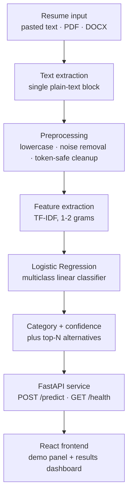

# ResumeForge — Resume Classification System

> Classify resumes into job categories with a confidence score, from pasted text, PDF or DOCX.


**Project status: pre-implementation scaffold.** The repository currently contains the project
structure, the design documentation and a substantial frontend component library. There is **no
Python source, no dataset, no trained model artifact and no evaluation output in the repository
yet**. Every metric in this document is marked `Pending` and names the exact file or command that
will produce it. Nothing in this README is estimated or invented.

---

## Contents

- [Overview](#overview)
- [Demo and Screenshots](#demo-and-screenshots)
- [System Architecture](#system-architecture)
- [Dataset](#dataset)
- [Methodology](#methodology)
- [Models and Results](#models-and-results)
- [Error Analysis](#error-analysis)
- [Project Structure](#project-structure)
- [Installation and Usage](#installation-and-usage)
- [API Reference](#api-reference)
- [Project Audit](#project-audit)
- [Limitations](#limitations)
- [Responsible AI](#responsible-ai)
- [Roadmap](#roadmap-and-future-improvements)
- [Reproducibility](#reproducibility)
- [Team and Acknowledgments](#team-and-acknowledgments)
- [License](#license)

---

## Overview

### Problem statement

Recruiters and HR teams receive large volumes of resumes for every posting and sort them manually.
Manual sorting is slow, inconsistent between reviewers and across hiring cycles, and leaves no
traceable record of why a document was filed where it was. Near-identical roles end up under
different labels, and judgement quality degrades with reviewer load.

ResumeForge applies a single, reproducible text-classification pass to every resume so that
filing is consistent, fast to re-run, and auditable on the same sample.

### What the system does

- Accepts resume content as **pasted text, PDF or DOCX**.
- Extracts plain text from documents and normalises it with a **token-safe cleaner** that
  preserves technical identifiers such as `C++`, `C#`, `.NET` and `Node.js`.
- Scores the text with a **TF-IDF (1–2 grams) + Logistic Regression** classifier — the model
  selected by the team for the demo.
- Returns the **predicted job category**, a **confidence score** and the **runner-up categories**
  so ambiguous cases stay visible instead of being hidden behind a single label.
- Serves predictions over an **inference-only FastAPI** endpoint consumed by a **React** frontend.

### Key features

| Feature | Detail |
| --- | --- |
| Three input paths | Pasted text, PDF upload, DOCX upload — one prediction contract for all three |
| Token-safe preprocessing | Protects `C++`, `C#`, `.NET`, `Node.js` and similar identifiers from being shredded by normalisation |
| Contact-data neutralisation | Emails, URLs and phone numbers are replaced with placeholders so the model cannot memorise identity strings |
| Confidence plus top-N | Every prediction carries a confidence score and up to five ranked alternatives |
| Leak-free evaluation intent | Stratified split with the TF-IDF vocabulary fitted on training data only |
| Single source of truth for metrics | All published numbers live in one file (`frontend/src/data/results.ts`) and the UI renders an explicit "pending" state instead of inventing values |
| Offline demo mode | The frontend falls back to a deterministic, clearly-labelled mock when no backend URL is configured |

---

## Demo and Screenshots

**Screenshots: to be added.** No screenshot images exist in the repository at this time, and no
live demo URL has been verified, so none are embedded here.

To produce them:

1. Start the frontend (`cd frontend && npm install && npm run dev`) and the backend
   (`uvicorn api.main:app --reload --port 8000`).
2. Set `VITE_API_URL=http://localhost:8000` in `frontend/.env.local` so the demo uses real
   predictions rather than mock mode.
3. Capture the landing page, the demo panel before/after a prediction, the results dashboard and
   the confusion matrix, then save them under `docs/` and reference them here.

The repository does contain three **synthetic** sample resumes (clearly marked as fictional in
`frontend/src/data/samples.ts`) that can be used for those captures without any real personal data.

---

## System Architecture



Stage by stage:

1. **Resume input.** Three entry points converge on one contract: pasted text, a PDF upload or a
   DOCX upload. The frontend already validates the request before it is sent — accepted extensions
   are `.pdf` and `.docx`, the size cap is 5 MB, and pasted text below 40 characters is rejected
   as too short to classify.
2. **Text extraction.** Document parsers strip layout and return one plain-text block, which is
   the only representation the model consumes. This matches training, where the input column is
   already-extracted text.
3. **Preprocessing.** A single reusable cleaner lowercases text, removes markup and whitespace
   noise, neutralises contact details, and protects technical tokens. Training and inference must
   call the identical function so the two can never drift apart.
4. **Feature extraction.** TF-IDF over unigrams and bigrams produces sparse features for the
   linear models. The vocabulary and IDF weights are fitted on the training split only.
5. **Classification.** Logistic Regression scores every category and yields a probability
   distribution, which is what makes a confidence score and top-N ranking possible at all.
6. **Response.** The top category is returned with its confidence and the ranked alternatives,
   wrapped in a payload the frontend already knows how to parse.
7. **Service and client.** The FastAPI service is inference-only: it loads the trained artifact
   and never retrains. The React frontend calls it, or falls back to a deterministic mock when no
   backend URL is set.

**Implementation status:** stages 1 and 7 have frontend code; stages 2–6 and the backend in stage 7
are not yet implemented in the repository.

---

## Dataset

### Source and structure

The project uses a resume–category dataset distributed as `Resume.csv` / `Resume.xlsx`. It is
**not committed to this repository and not redistributed**; only derived metrics and code are
published. The expected schema is fixed by the frontend data contract in
`frontend/src/data/results.ts`:

| Column | Role | Description |
| --- | --- | --- |
| `ID` | Identifier | Row key, referenced in error-analysis tables |
| `Resume_str` | **Input** | Plain-text extracted resume body used for training and inference |
| `Resume_html` | Not used | Raw HTML source retained in the file but excluded from the model |
| `Category` | **Target** | Job category label the resume is classified into |

`Resume_html` must stay out of the feature set. The HTML column frequently contains the job title
itself, so including it would leak the label.

### How to obtain it

The dataset is not bundled. Place the file locally at `data/Resume.csv`; `.gitignore` already
excludes `*.csv` and `*.xlsx`, so it will not be committed by accident.

### Dataset statistics

**Pending — to be generated by running the pipeline.** Every value below comes from
`reports/data_audit.json`, which is produced by the data-audit step. No such file exists yet, and
the class list itself is unknown until the file is loaded.

| Statistic | Value | Source |
| --- | --- | --- |
| Rows | Pending | `reports/data_audit.json` |
| Columns | 4 (`ID`, `Resume_str`, `Resume_html`, `Category`) | Schema defined in `frontend/src/data/results.ts` |
| Distinct classes | Pending | `reports/data_audit.json` |
| Missing values per column | Pending | `reports/data_audit.json` |
| Duplicate rows / near-duplicate resumes | Pending | `reports/data_audit.json` |
| Empty or near-empty resumes | Pending | `reports/data_audit.json` |
| Character length — min / mean / median / max | Pending | `reports/data_audit.json` |
| Word count — min / mean / median / max | Pending | `reports/data_audit.json` |
| Train / validation / test split ratio | Pending | To be set in the split step |

---

## Methodology

The workflow follows the hackathon sequence: problem understanding → data gathering → data quality
check → EDA → text preprocessing → train/validation/test split → feature engineering → classical
ML → deep learning → evaluation → error analysis → final pipeline and demo.

The design for each stage is recorded in `frontend/src/data/content.ts`; the implementations are
not yet present in the repository.

### Data quality

Planned checks: row and column counts, per-column missing values, empty and near-empty documents,
exact duplicates and near-duplicates, and class balance. The audit is expected to write
`reports/data_audit.json` so every downstream number has a traceable origin.

### Exploratory analysis

Planned analysis: class distribution, resume length distribution, word-frequency inspection,
per-class vocabulary, n-gram inspection (unigrams, bigrams, trigrams) and a WordCloud of the
corpus. Output artefacts: `reports/figures/`.

### Text preprocessing

Preprocessing is specified as a single reusable function, called identically by training and
inference.

| Concern | Decision |
| --- | --- |
| Technical tokens | `C++`, `C#`, `.NET`, `Node.js`, `SQL`, `AWS` and similar identifiers are protected before normalisation |
| URLs | Replaced with a placeholder so the model cannot memorise link strings |
| Emails | Replaced with a placeholder for the same reason |
| Phone numbers | Replaced with a placeholder |
| Casing and whitespace | Lowercased; repeated headers and collapsed whitespace removed |
| Markup noise | HTML/layout artefacts from HTML-derived resumes stripped before vectorisation |

### Split strategy

A **stratified** train/validation/test split so class proportions are preserved and minority
categories remain represented in the evaluation split. The concrete ratio and `random_state` are
**Pending** — placeholders currently sit in `frontend/src/data/results.ts` under `evaluationSetup`
as literal instruction strings that must be replaced with the real values.

### Leakage control

The TF-IDF vectorizer is fitted on the **training split only**; the resulting vocabulary and IDF
weights are then applied to the validation and test splits. Fitting before splitting would leak
test-set term statistics into training and inflate every reported score.

### Feature engineering

TF-IDF over **1–2 grams** for the linear models. Configuration details beyond the n-gram range
(minimum document frequency, sublinear TF, stop-word handling) are **Pending** and will be fixed
once the vocabulary is inspected during EDA.

### Model training

Logistic Regression is the model selected by the team for the main system and demo. Linear SVM
and Multinomial Naive Bayes are planned as classical baselines, and a Word2Vec + BiLSTM
comparison is planned for the deep-learning stage. Training code, hyperparameters and the
serialized artifact are **not yet in the repository**.

---

## Models and Results

**No model has been trained or evaluated inside this repository, so no accuracy or F1 figure is
published here.** Every metric cell below is `Pending` and will be filled from
`reports/model_results.csv`. The model roster is the set already declared in
`frontend/src/data/results.ts`.

| Model | Family | Accuracy | Macro-F1 | Weighted-F1 | Precision | Recall | Train time |
| --- | --- | --- | --- | --- | --- | --- | --- |
| Multinomial Naive Bayes | Classical ML | Pending | Pending | Pending | Pending | Pending | Pending |
| **Logistic Regression** (selected for demo) | Classical ML | Pending | Pending | Pending | Pending | Pending | Pending |
| Linear SVM | Classical ML | Pending | Pending | Pending | Pending | Pending | Pending |
| Word2Vec + BiLSTM | Deep learning | Pending | Pending | Pending | Pending | Pending | Pending |

### Best model and selection rule

**Pending — determined by macro-F1 on the held-out test split.**

The selection rule is fixed in advance and is not accuracy: on an imbalanced multi-class problem,
accuracy can look strong while minority categories score close to zero. Macro-F1 weights every
category equally, so a model cannot win by doing well on the majority classes alone. The selection
logic is already implemented on the frontend (`bestModel()` in `frontend/src/lib/results.ts`
reduces over macro-F1 and ignores rows still marked pending) and will highlight the winning row
automatically once real values are entered.

### Per-class metrics

<details>
<summary>Per-class precision, recall, F1 and support (Pending)</summary>

No per-class metrics have been computed. The table is populated from `reports/model_results.csv`
and mirrored into `perClassMetrics` in `frontend/src/data/results.ts`, which is currently an
empty array. The frontend renders an explicit pending state for this section rather than a blank
or invented table.

</details>

### Confusion matrix

**Not embedded — `reports/figures/confusion_matrix.png` does not exist yet.** Generate it from the
test-split predictions with scikit-learn's `ConfusionMatrixDisplay`, save it to that path, and it
can be embedded here. Row = true class, column = predicted class.

---

## Error Analysis

**Pending — to be generated by running the pipeline.** Findings must come from
`reports/error_analysis.csv`; no such file exists yet and no misclassifications have been
inspected.

The candidate error modes below are **hypotheses to be tested**, not findings. They are the
failure modes already anticipated by the project's design notes in
`frontend/src/data/results.ts` (`errorNotes`), and each one still needs at least one concrete
example from the test split before it can be claimed.

| Hypothesis | What would confirm it |
| --- | --- |
| Overlapping categories | A single-label ground truth punishing a defensible alternative category |
| Generic resumes | Boilerplate-heavy documents with no role-specific vocabulary |
| Very short resumes | Documents too short to expose enough informative terms |
| Noisy extracted text | Extraction artefacts, tracking pixels and layout fragments diluting features |
| Inconsistent source labels | Rows whose text clearly contradicts the assigned `Category` |

---

## Project Structure

Generated from the current repository contents. Directories that exist but are still empty are
shown with their `.gitkeep` placeholder.

```text
RCS/
├── .gitignore                     # Python/Node ignores; excludes datasets and model binaries
├── README.md                      # This document
├── app/                           # EMPTY placeholder (.gitkeep) — unused; API is planned under api/
├── data/                          # EMPTY placeholder (.gitkeep) — local dataset lives here, git-ignored
├── models/                        # EMPTY placeholder (.gitkeep) — trained artifact destination
├── notebooks/                     # EDA and model-experiment notebooks
│   └── README.md                  # Placeholder text only — no notebooks yet
├── reports/                       # EMPTY placeholder (.gitkeep) — metrics, audits and figures
├── src/                           # Python package: preprocessing, features, training, prediction
│   └── README.md                  # Placeholder text only — no Python modules yet
└── frontend/                      # React 18 + TypeScript + Vite + Tailwind web app
    ├── .env.example               # Documented frontend environment variables
    ├── .gitignore                 # Node ignores (node_modules, dist, .env.local)
    ├── .prettierignore            # Prettier exclusions
    ├── .prettierrc.json           # Formatting rules
    ├── eslint.config.js           # ESLint flat config
    ├── index.html                 # HTML shell; loads /src/main.tsx
    ├── package.json               # Scripts and dependencies (dev, build, lint, typecheck)
    ├── postcss.config.js          # PostCSS pipeline
    ├── tailwind.config.ts         # Tailwind theme tokens
    ├── tsconfig.json              # TypeScript project references
    ├── tsconfig.app.json          # App TS config; strict mode, "@/*" path alias
    ├── tsconfig.node.json         # Node-side TS config (Vite config)
    ├── vite.config.ts             # Vite build config; dev server on port 5173
    ├── public/
    │   ├── favicon.svg            # Site icon
    │   ├── og-cover.svg           # Social share image
    │   └── site.webmanifest       # PWA manifest
    └── src/
        ├── main.tsx               # MISSING — referenced by index.html; app cannot build without it
        ├── App.tsx                # MISSING — no router/pages exist yet
        ├── styles/index.css       # Tailwind entry point and global styles
        ├── components/
        │   ├── charts/            # 4 chart components: class distribution, length histogram,
        │   │                      # model comparison, shared tooltip
        │   ├── demo/              # Mock-mode banner shown when no backend is configured
        │   ├── layout/            # 6 layout components: navbar, footer, layout shell,
        │   │                      # theme provider/toggle, scroll-to-top
        │   ├── sections/          # 11 page sections: hero, hero mockup, stats strip, problem,
        │   │                      # pipeline, features, models showcase, results preview,
        │   │                      # demo teaser, FAQ, responsible AI
        │   └── ui/                # 18 reusable primitives: button, card, badge, table, tabs,
        │                          # accordion, alert, dropzone, gauge, heatmap, chart frame,
        │                          # progress bar, container, logo, reveal, spinner, pending state
        ├── data/
        │   ├── content.ts         # Static site copy: pipeline steps, features, FAQ, methodology
        │   ├── results.ts         # SINGLE SOURCE OF TRUTH for every published metric (all pending)
        │   ├── samples.ts         # Three clearly-fictional synthetic sample resumes
        │   └── site.ts            # Brand strings, navigation, API base URL, upload limits
        ├── hooks/                 # 6 hooks: theme, media query, count-up, clipboard, document meta
        └── lib/
            ├── api.ts             # Typed API client, response validation, deterministic mock mode
            ├── cn.ts              # Class-name joiner
            ├── download.ts        # Client-side file download helper
            ├── format.ts          # Number/percent formatting with pending-value handling
            ├── motion.ts          # Framer Motion variants
            ├── results.ts         # Availability checks and best-model-by-macro-F1 logic
            ├── theme.ts           # Theme resolution and persistence
            └── validators.ts      # Upload and pasted-text validation (5 MB, .pdf/.docx, min length)
```

**Not yet present:** `api/` (FastAPI service), `requirements.txt`, `tests/`, `LICENSE`,
`reports/*.csv|json`, `reports/figures/`, `notebooks/*.ipynb`, `frontend/src/main.tsx`,
`frontend/src/App.tsx`.

---

## Installation and Usage

### Prerequisites

| Tool | Version | Note |
| --- | --- | --- |
| Python | Pending — to be pinned | No `requirements.txt`, `pyproject.toml` or `.python-version` exists yet; pin one before the demo |
| Node.js | Pending — to be pinned | Required by the frontend; `package.json` targets Vite 5 |
| pip / venv | Any current version | — |

### Backend (FastAPI)

```bash
# 1. Create and activate a virtual environment
python -m venv .venv
# Windows
.venv\Scripts\activate
# macOS / Linux
source .venv/bin/activate

# 2. Install dependencies
pip install -r requirements.txt

# 3. Run the inference API
uvicorn api.main:app --reload --port 8000
```

> **Status:** `requirements.txt` and `api/` do not exist yet. The command above is the agreed target
> contract; it will work once `requirements.txt`, `api/main.py` and the model artifact in `models/`
> are added (see [Action Plan](#e-prioritized-action-plan)).

Interactive API docs will be available at `http://localhost:8000/docs` once the service exists.

### Frontend (React)

```bash
cd frontend
npm install
npm run dev        # dev server on http://localhost:5173
npm run build      # type-check with tsc, then production build
npm run preview    # serve the production build
npm run lint       # ESLint
npm run typecheck  # TypeScript project check
npm run format     # Prettier
```

> **Status:** `frontend/src/main.tsx` and `frontend/src/App.tsx` are missing, so `index.html` points
> at an entry module that does not exist and the app will not start until they are added.

### Tests

```bash
pytest              # Python tests
pytest -q tests/test_preprocess.py
```

> **Status:** there is no `tests/` directory, no `pytest` configuration and no test runner for the
> frontend. Both are listed in the action plan.

### Prediction from the CLI

> **Status:** no CLI entry point exists yet. The agreed shape, to be implemented as
> `src/predict.py`, is:

```bash
# From pasted text
python -m src.predict --text "Python developer with 5 years of experience in Django and PostgreSQL..."

# From a file
python -m src.predict --file data/sample_resume.pdf
```

### Example API requests

```bash
# POST /predict — JSON text input
curl -X POST http://localhost:8000/predict \
  -H "Content-Type: application/json" \
  -d '{"text": "Python developer with 5 years of experience in Django and PostgreSQL."}'
```

```bash
# POST /predict — file upload
curl -X POST http://localhost:8000/predict \
  -F "file=@data/sample_resume.pdf"
```

Response shape — defined by the frontend client in `frontend/src/lib/api.ts`. Field names are
fixed; **values shown are illustrative placeholders, not measured output**:

```json
{
  "predicted_category": "<one of the dataset Category values>",
  "confidence": 0.0,
  "top_predictions": [
    { "category": "<category>", "probability": 0.0 },
    { "category": "<category>", "probability": 0.0 }
  ],
  "model": "<model identifier>",
  "extracted_chars": 0
}
```

Errors are returned as `{"error": "<message>"}`.

```bash
# GET /health
curl http://localhost:8000/health
```

```json
{ "status": "ok" }
```

> **Status:** `GET /health` is **not implemented and not referenced anywhere in the current code**.
> The response above is the proposed contract that the FastAPI service must satisfy.

### Environment variables

Documented in `frontend/.env.example`. Copy it to `frontend/.env.local` and fill in the values.

| Variable | Purpose | Default |
| --- | --- | --- |
| `VITE_API_URL` | Base URL of the FastAPI backend exposing `POST /predict`. Empty means the frontend runs in clearly-labelled mock mode | Empty (mock mode) |
| `VITE_LOW_CONFIDENCE_THRESHOLD` | Confidence below which the demo panel shows a low-confidence warning (0–1) | `0.5` |
| `VITE_GITHUB_URL` | Public repository URL shown in the navbar hero and footer | Set in `.env.example` to a GitHub URL — verify it points at this repository before publishing |
| `VITE_MODEL_LABEL` | Optional label displayed next to the backend model name on the result card | Empty |

Backend environment variables: **To be added.** There is no root `.env.example`. At minimum the
FastAPI service will need a model-artifact path, a maximum upload size and a CORS origin list. Add
them to a new root `.env.example` with real defaults and document them in this table.

---

## API Reference

Endpoints below are taken from the actual code. `frontend/src/lib/api.ts` is the only place an
endpoint contract currently exists; the backend that must satisfy it has not been written.

| Method | Path | Description | Request | Defined in |
| --- | --- | --- | --- | --- |
| `POST` | `/predict` | Classify a resume and return the predicted category, confidence and top-N alternatives | `multipart/form-data` with `file` (`.pdf`/`.docx`) **or** `application/json` with `{"text": "..."}` | `frontend/src/lib/api.ts` (client side) |
| `GET` | `/health` | Service liveness check | — | **To be added** — not implemented, not referenced in code |

Response contract for `POST /predict` (from `frontend/src/lib/api.ts`):

| Field | Type | Description |
| --- | --- | --- |
| `predicted_category` | string | Top predicted category (required; the client rejects a response without it) |
| `confidence` | number | Score in `[0, 1]`, clamped by the client |
| `top_predictions` | array | Up to 5 `{category, probability}` objects, sorted descending |
| `model` | string | Model identifier for display |
| `extracted_chars` | number | Length of the extracted text, for display |

Errors: `{"error": "<message>"}` with a non-2xx status.

---

## Project Audit

Every item below was verified by inspecting the repository at the current commit. Status key:
🟢 complete and verified · 🟡 present but needs improvement · 🔴 missing or not implemented.

### A. Audit summary

| Area | Status | Score (/10) | Problems found | Fixes / next steps |
| --- | --- | --- | --- | --- |
| Repository structure | 🟡 | 4 | Consistent top-level layout, but `app/` is an unused empty directory while the API is planned at `api/`; no Python package layout; the whole `frontend/` tree is untracked in git | Decide on `api/` vs `app/` and delete the unused one; add `api/`, `tests/`; commit `frontend/` |
| README | 🟡 | 6 | Previous version was 31 lines with no results, no structure, no usage and no audit; this rewrite fixes that, but results, screenshots and API docs remain pending | Keep sections 5, 7, 8 and 10 synchronised as artifacts land |
| .gitignore | 🟡 | 7 | Good coverage (`__pycache__`, `.env`, `*.csv`, `*.xlsx`, `*.pkl`, `*.joblib`, checkpoints, OS files) — but `*.pkl`/`*.joblib` will also block committing the inference artifact the API must load | Add explicit negations for `models/*.joblib`; add `*.png`/figure policy; keep dataset rules strict |
| Dataset | 🔴 | 2 | Not present, not committed (by design), no download helper, no schema validation, no checksum | Add `data/README.md` documenting provenance, expected schema and how to place the file |
| Data quality | 🔴 | 1 | No audit code and no `reports/data_audit.json` | Implement the audit step and commit the JSON report |
| EDA | 🔴 | 1 | `notebooks/` contains only a README; no analysis, no figures, no vocabulary or frequency output | Run EDA and save plots to `reports/figures/` |
| Preprocessing | 🔴 | 2 | No Python code. The design (token protection, contact neutralisation) exists only as frontend copy | Implement `src/preprocess.py` as one function shared by training and inference |
| Feature engineering (TF-IDF) | 🔴 | 2 | No vectorizer code, no fitted artifact, no configuration | Implement `src/features.py`; fit on the training split only |
| Classical ML | 🔴 | 2 | No training code and no `reports/model_results.csv`. The team reports Logistic Regression was trained, but nothing in the repository substantiates it | Commit the training script, the metrics CSV and the serialized model |
| Deep learning | 🔴 | 0 | Not implemented. `frontend/src/data/content.ts` nevertheless advertises a Word2Vec + BiLSTM row and lists Gensim/BiLSTM in the stack — the copy contradicts the repo | Either implement it or remove it from the site copy and mark it out of scope |
| Evaluation | 🔴 | 1 | No metrics computed or stored; no confusion matrix | Run evaluation and write `reports/model_results.csv` plus `reports/figures/confusion_matrix.png` |
| Error analysis | 🔴 | 1 | `errorRows` is an empty array; the five `errorNotes` are untested hypotheses | Produce `reports/error_analysis.csv` with real misclassifications |
| Prediction pipeline | 🔴 | 2 | No inference code exists. Only a deterministic frontend mock (`mockPredict`) is present, which is explicitly not a model | Implement `src/predict.py` and the pipeline it wraps |
| Backend API | 🔴 | 3 | No FastAPI code. A well-specified, typed client contract exists in `frontend/src/lib/api.ts`, which is a strong starting point | Implement `api/main.py`, `api/schemas.py`, `api/extractor.py`; add `GET /health`; set CORS and upload limits |
| Frontend | 🟡 | 6 | Substantial and well-documented: 39 components, strict TypeScript, typed API client with response validation, mock mode, honest pending states. But `index.html` loads `/src/main.tsx`, which does not exist, and there are no page/route components for the four routes in `site.ts` | Add `main.tsx` and `App.tsx` with routes for `/`, `/demo`, `/results`, `/about`; commit the tree |
| Testing | 🔴 | 0 | No `tests/`, no pytest config, no frontend test runner; `package.json` has no `test` script | Add `pytest` tests for preprocessing and the predict contract; add Vitest for `validators.ts` and `parsePredictResponse` |
| Security | 🟡 | 6 | No secrets or keys committed; `.env`/`.env.local` ignored; datasets excluded; the three demo resumes in `samples.ts` are verifiably fictional. Gaps: pickle/joblib artifacts execute code on load, no server-side size/type enforcement, no dependency scanning | Prefer a non-executable model format where possible, checksum artifacts, enforce the 5 MB cap and `.pdf`/`.docx` server-side, add CORS allow-list |
| Reproducibility | 🔴 | 2 | No pinned Python dependencies, no `random_state`, no saved artifacts, no `reports/` output; frontend uses caret ranges with no committed lockfile | Add pinned `requirements.txt`, fix seeds, commit the trained artifact and a run manifest |
| Documentation | 🟡 | 6 | Frontend data files are exceptionally well documented, but there is no root documentation beyond this README and two placeholder READMEs | Add `data/README.md`, `reports/README.md` and `api/README.md` |
| Git history/configuration | 🟡 | 3 | A single commit (`Initial project setup`); the entire `frontend/` directory is untracked; no `LICENSE`, no CI, no contributing guide | Commit the frontend, add a LICENSE, add CI for lint/typecheck/pytest |

### B. Detailed findings

<details>
<summary><strong>Code quality</strong></summary>

**Verified strengths**

- TypeScript config is strict by default: `strict`, `noUnusedLocals`, `noUnusedParameters`,
  `noFallthroughCasesInSwitch`, `verbatimModuleSyntax` in `frontend/tsconfig.app.json`.
- The `@/` path alias is defined consistently in both `tsconfig.app.json` and `vite.config.ts`.
- All 28 distinct `@/...` import targets resolve to real files — no dead imports.
- Data is cleanly separated from presentation: every metric lives in `frontend/src/data/results.ts`
  and every string in `content.ts`/`site.ts`, so components stay presentational.
- Comments are purposeful, not decorative. `results.ts` and `content.ts` both carry explicit
  "do not fabricate numbers" instructions, and the UI renders pending states rather than blanks.
- Prettier and ESLint are both configured with runnable scripts.

**Problems**

- `frontend/index.html` loads `/src/main.tsx`, which does not exist. The frontend cannot build or
  serve until the entry point is added — this is the single blocking frontend defect.
- `frontend/src/data/content.ts` marks all ten `methodologyTimeline` stages as `Complete`. That is
  false against the current repository state and is the most damaging inaccuracy in the project.
- `frontend/src/data/content.ts` advertises Gensim Word2Vec, BiLSTM, Matplotlib and Seaborn in
  `mlStack`; none are present.
- `frontend/src/data/results.ts` declares `export const PENDING = 'TBD'` — the constant name and its
  value disagree, which will confuse anyone filling the file in.
- `frontend/src/data/results.ts` and `content.ts` still contain literal instruction strings
  ("add your ratio and random_state", "add your calibration note") in user-facing data fields.
- `frontend/src/data/site.ts` hardcodes a fallback GitHub URL that will silently go stale.
- `app/` is an empty, unused directory; the agreed API module path is `api/`.
- No Python source exists, so PEP 8 compliance, docstring coverage, error handling and unused-import
  hygiene cannot be assessed. PEP 8 and type hints should be enforced from the first module.

</details>

<details>
<summary><strong>Reproducibility</strong></summary>

- No `requirements.txt`, `pyproject.toml`, `poetry.lock`, `environment.yml` or `.python-version`.
  The Python version itself is unpinned, so "Python 3.x" is all that can honestly be claimed.
- No `random_state` is set anywhere, because there is no code to set it in. The stratified split,
  the shuffle and any deep-learning initialisation all need explicit seeds.
- `models/` contains only `.gitkeep`; no serialized artifact is stored or versioned.
- `reports/` contains only `.gitkeep`; no metrics, audits or figures.
- The frontend has no committed lockfile and uses caret ranges (`react: ^18.3.1`, `vite: ^5.4.10`),
  so two installs months apart will not resolve identically.
- No run manifest recording seed, library versions, split ratio and git commit alongside each
  result. Without it, a metric in this README cannot be tied to a specific run.

</details>

<details>
<summary><strong>Security</strong></summary>

**Verified positives**

- No API keys, tokens or credentials anywhere in the tracked tree.
- `.env` is ignored at the root and `.env`/`.env.local` in `frontend/`; only `.env.example` is
  committed, and it contains placeholders rather than secrets.
- Datasets are excluded by `*.csv` and `*.xlsx`, so the raw resume file cannot be committed by
  accident. This matters because resumes contain personal data.
- No personal data is committed. The three demo resumes in `frontend/src/data/samples.ts` carry an
  explicit header stating they are fictional, and the names, employers and figures are invented.
- The frontend validates untrusted API responses (`parsePredictResponse`) instead of trusting the
  payload, and the mock category pool is documented as a UI placeholder rather than a label set.

**Risks to address**

- `joblib`/`pickle` artifacts execute arbitrary code on load. The current `.gitignore` excludes
  those formats entirely, which is right for datasets but blocks the artifact the API must load.
  Load only trusted, checksummed artifacts, and prefer a non-executable format (skops, ONNX) where
  the model allows it.
- No API exists, so none of the following are enforced anywhere: upload size limit (the frontend
  assumes 5 MB), MIME/extension allow-listing, CORS allow-list, request timeouts, rate limiting.
- `Resume_html` must stay excluded from features; it often contains the job title and would leak
  the label.
- No dependency scanning or automated update workflow, and several frontend dependencies are on
  older major versions (React 18, Vite 5).
- `frontend/.env.example` ships a concrete repository URL — confirm it is the intended public repo
  before publishing.

</details>

<details>
<summary><strong>Data leakage risks</strong></summary>

- Cannot be fully assessed yet: no split or vectorizer code exists. The *documented intent* is
  correct — stratified split, vectorizer fitted on training data only, duplicate checks, test set
  used once — and is recorded in `frontend/src/data/content.ts`.
- Resume corpora typically contain templated and near-duplicate documents. Without an explicit
  near-duplicate check before splitting, the same CV can appear on both sides and inflate scores.
  Deduplicate (exact and near-duplicate) **before** the split, not after.
- Fitting the vectorizer on the full dataset before splitting leaks IDF and vocabulary statistics
  from the test split into training. This is the most common way a TF-IDF pipeline reports a
  number that will not reproduce.
- Tuning hyperparameters or the preprocessing function against the test split converts it into a
  validation set. Keep a separate validation split and touch the test split once.
- `Resume_html` is a label-leakage vector for the same reason as above.
- Placeholder strings in `evaluationSetup` mean the split ratio and seed are currently unspecified;
  unspecified seeds are a reproducibility risk even when leakage is absent.

</details>

<details>
<summary><strong>ML / NLP weaknesses</strong></summary>

- No trained model exists in the repository, so every evaluation question is still open.
- The planned feature set is bag-of-words (TF-IDF, 1–2 grams). Word order and context are lost, so
  categories that share vocabulary will collide regardless of classifier quality.
- Probability outputs from an uncalibrated linear model are not calibrated probabilities and should
  be presented as relative scores.
- Single-label ground truth penalises genuinely hybrid resumes; this will show up as irreducible
  error in any confusion matrix.
- The category set is fixed by the training data. The system cannot propose a new category, and it
  will force every document into the nearest known label.
- English-only assumption; resumes in other languages will be classified unreliably.
- Short resumes are close to unclassifiable with sparse features — the frontend already rejects
  pasted text under 40 characters, which is a reasonable guard.
- Any label noise in the source data is inherited directly by the model and is not separable from
  model error without manual inspection.

</details>

<details>
<summary><strong>Deployment weaknesses</strong></summary>

- No `Dockerfile`, `docker-compose.yml`, process manager, reverse-proxy config or hosting setup.
- No CI/CD: lint, typecheck and tests are not enforced anywhere.
- The model-loading strategy is undefined — artifact path, eager vs lazy load, and how a retrained
  model replaces the running one.
- `GET /health` does not exist, so there is no liveness or readiness signal for a deployment.
- No structured logging or request logging, which the project's own future-work notes call for as
  an auditing requirement.
- No timeout or concurrency limits for file uploads; a 5 MB PDF parsed per request with no bound is
  a straightforward resource-exhaustion path.
- Python dependency versions unpinned, so the serving environment cannot be reproduced.

</details>

### C. Hackathon requirement checklist

`[x]` is used only where an artifact verifiable in the repository exists. Design intent documented
in the frontend copy is **not** counted as complete.

**Data understanding and quality**

- [ ] Class distribution
- [ ] Resume text length distribution
- [ ] Word count distribution
- [ ] Missing-value analysis
- [ ] Empty / near-empty resume detection
- [ ] Duplicate and near-duplicate detection
- [ ] Noisy-text analysis
- [ ] Class-specific vocabulary
- [ ] Word-frequency analysis
- [ ] WordCloud

**Text and n-gram analysis**

- [ ] Unigram analysis
- [ ] Bigram analysis
- [ ] Trigram analysis

**Modelling**

- [ ] TF-IDF baseline
- [ ] Logistic Regression
- [ ] Linear SVM
- [ ] Naive Bayes
- [ ] Word2Vec embeddings
- [ ] LSTM / GRU / dense neural model

**Evaluation**

- [ ] Accuracy
- [ ] Precision
- [ ] Recall
- [ ] F1
- [ ] Macro-F1
- [ ] Weighted-F1
- [ ] Confusion matrix
- [ ] Per-class metrics

**Delivery**

- [ ] Error analysis
- [ ] Reproducible prediction pipeline
- [ ] Simple prediction interface

<details>
<summary>Items whose <em>design</em> is documented in the repository but which have no implementation or artifact yet</em></summary>

These are described in `frontend/src/data/content.ts` and `frontend/src/data/results.ts`, and are
marked "not implemented" only because no verifiable code or output exists:

- Data quality checks, EDA, duplicate checks, stratified split, vectorizer-fit scope (design only)
- Token-safe preprocessing and contact-data neutralisation (design only)
- TF-IDF 1–2 grams, Logistic Regression, Linear SVM, Multinomial Naive Bayes (planned roster only)
- Word2Vec + BiLSTM (planned only; the site copy currently overstates this as complete)
- The five error-analysis hypotheses (untested)
- `POST /predict` contract and a deterministic mock prediction interface (frontend only)

</details>

### D. Final scorecard

Formulas, stated explicitly:

```text
Hackathon requirement completion = verified checklist items / total items
                                = 0 / 30
                                = 0.0%

Engineering readiness           = (1.0 x green areas + 0.5 x yellow areas + 0.0 x red areas) / total areas
                                = (1.0 x 0 + 0.5 x 7 + 0.0 x 13) / 20
                                = 3.5 / 20
                                = 17.5%

Current project score            = engineering readiness x 10
                                = 17.5% x 10
                                = 1.75  ->  1.8 / 10
```

| Metric | Value | Derivation |
| --- | --- | --- |
| Current project score | **1.8 / 10** | 17.5% engineering readiness × 10 |
| Hackathon readiness | **0%** | 0 of 30 required items have a repository-verifiable artifact |
| Estimated technical completion | **17.5%** | 7 yellow areas of 20, no green areas |

Cross-check: the unweighted mean of the 20 individual area scores is 57/20 = **2.9 / 10**. The
conservative status-derived figure of 1.8 is reported above.

The 0% checklist figure is not a judgement about the team's effort — it measures only what is
verifiable in the repository today. The gap is almost entirely **missing artifacts**, not missing
design: the intended methodology, the API contract, the frontend and the reporting structure are
all in place. Committing the training code, the metrics and the backend would move these numbers
sharply.

### E. Prioritized action plan

1. **Write the Python pipeline and pin it.** Add `requirements.txt` with pinned versions,
   `.python-version`, and `src/preprocess.py`, `src/features.py`, `src/train.py`, `src/predict.py`.
   Everything else depends on this. Set `random_state` in the split and in every model.
2. **Generate the report artifacts.** Run the audit, EDA and training so that
   `reports/data_audit.json`, `reports/model_results.csv`, `reports/error_analysis.csv` and
   `reports/figures/confusion_matrix.png` exist. This alone converts most of the 30 checklist
   items from `[ ]` to `[x]` and makes sections 5, 7 and 8 of this README real.
3. **Implement the FastAPI service** at `api/main.py` (plus `schemas.py`, `extractor.py`) to the
   contract already encoded in `frontend/src/lib/api.ts`, including `GET /health`, a CORS
   allow-list, and server-side enforcement of the 5 MB / `.pdf`/`.docx` limits.
4. **Fix `.gitignore` for the model artifact.** Add an explicit allow-rule for the one artifact the
   API loads (prefer a non-executable format, and checksum it), without loosening the dataset rules.
5. **Make the frontend run.** Add `src/main.tsx` and `App.tsx` with routes for `/`, `/demo`,
   `/results` and `/about`, then commit the entire `frontend/` tree — it is currently untracked.
6. **Correct the site copy.** Set `methodologyTimeline` statuses to their true state and remove
   Gensim/BiLSTM from `mlStack` until they exist. Publishing "Complete" against an empty repository
   is the fastest way to lose credibility in a review.
7. **Add tests.** `tests/` with pytest for preprocessing determinism and the predict contract, plus
   Vitest for `validators.ts` and `parsePredictResponse` (both are pure and cheap to test).
8. **Add a LICENSE and a root `.env.example`**, then fill the pending rows in the environment
   variable table.
9. **Add CI** running frontend lint/typecheck and pytest, so the audit findings cannot regress.
10. **Capture screenshots** and embed them in the Demo section, using the synthetic sample resumes.

---

## Limitations

These are properties of the current design and dataset, stated so the system is not read as more
capable than it is.

- **Confidence is only roughly calibrated.** Output comes from an uncalibrated linear classifier;
  treat the score as a relative ranking signal, not as a probability. Calibration was not performed.
- **Scanned PDFs are not supported.** Image-only PDFs have no extractable text layer and will
  produce empty or near-empty input. OCR is not implemented.
- **Extraction quality is inherited from the parser.** Layout-heavy, table-based or image-embedded
  documents degrade the text before the model ever sees it.
- **English resumes are assumed.** The dataset and the cleaner are English-only; other languages
  will be classified unreliably.
- **The category set is fixed by the training data.** The model classifies into the categories it
  was trained on and cannot propose a new one. It will always return the nearest known label.
- **Possible label noise in the source data** is inherited directly, and cannot be distinguished
  from model error without manual inspection.
- **Bag-of-words features ignore word order and context**, which limits separation between
  categories that share vocabulary.
- **Single-label ground truth** penalises genuinely hybrid resumes.
- **No human-in-the-loop workflow is built yet.** The system surfaces a confidence score, but no
  review queue, override path or feedback capture exists.
- **Not yet reproducible from the repository**, because dependencies are unpinned, seeds are
  unset and no artifact is committed.

---

## Responsible AI

> This system is intended for resume classification/organization and should not be used as the sole
> basis for employment decisions.

**Fairness.** A model trained on historical resumes reproduces the patterns in that data. Category
labels, vocabulary bias and an unbalanced class distribution can translate directly into uneven
error rates across demographic groups, and none of those rates can be measured until per-group
evaluation exists. The system should be used to organise and route documents, never to rank or
screen people.

**Privacy.** Resume content is sensitive personal data. In the hackathon demo, uploaded text is
processed for prediction only and is not written to disk or logged — and the preprocessing step
neutralises emails, URLs and phone numbers before vectorisation so contact strings are not learned
as features. The raw dataset is deliberately not redistributed in this repository.

**Human oversight.** Every prediction carries a confidence score and ranked alternatives precisely
so a human can see when the model is unsure. Low-confidence results should be routed to manual
review rather than auto-filed. A production deployment would need an auditable decision log, a
defined appeal or correction path, and monitoring for drift before any of this output is relied on.

---

## Roadmap and Future Improvements

### Done

- [x] Repository scaffolding with `data/`, `models/`, `notebooks/`, `reports/`, `src/`
- [x] `.gitignore` protecting datasets, secrets and model binaries
- [x] Documented project objective, problem statement and hackathon workflow
- [x] Frontend foundation: Vite + React 18 + TypeScript (strict) + Tailwind, lint and format configs
- [x] 39 frontend components across layout, UI primitives, charts and page sections
- [x] Typed API client with runtime response validation and deterministic mock mode
- [x] Single-source-of-truth metrics file with honest pending states
- [x] Upload and pasted-text validation (extension, MIME, 5 MB size, minimum length)
- [x] Exact responsible-AI statement wired into the UI
- [x] Three clearly-fictional synthetic sample resumes
- [x] This README, including the full project audit

### In progress

- [ ] TF-IDF (1–2 grams) + Logistic Regression model — reported as trained by Person 2, but no
      training script, artifact or metrics file is in the repository yet

### Not started

- [ ] Dataset placed locally and audited (`reports/data_audit.json`)
- [ ] EDA notebook and figures (class distribution, length, word frequency, WordCloud, n-grams)
- [ ] Preprocessing module shared by training and inference
- [ ] Stratified train/validation/test split with fixed seeds
- [ ] Classical baselines: Multinomial Naive Bayes, Linear SVM
- [ ] Deep-learning comparison: Word2Vec + BiLSTM
- [ ] Evaluation: accuracy, precision, recall, F1, macro-F1, weighted-F1, confusion matrix,
      per-class metrics
- [ ] Error analysis from real misclassifications
- [ ] FastAPI inference service with `POST /predict` and `GET /health`
- [ ] CLI prediction entry point
- [ ] Test suite (pytest + frontend unit tests)
- [ ] Screenshots and a live demo link
- [ ] LICENSE and root `.env.example`
- [ ] Probability calibration so confidence becomes trustworthy
- [ ] Multi-label support for genuinely hybrid roles
- [ ] Transformer encoder fine-tuning for contextual document embeddings
- [ ] Containerised deployment with request logging for auditing
- [ ] Cloud deployment

---

## Reproducibility

Current state, stated plainly: **the project is not yet reproducible from the repository alone.**

| Item | Status | Where it will live |
| --- | --- | --- |
| Fixed random seeds | Pending — no code to seed yet | `src/` training and split modules |
| Deterministic stratified split | Pending | Split step in `src/train.py` |
| Pinned Python dependencies | Pending — no `requirements.txt` exists | `requirements.txt` |
| Pinned Python version | Pending — no `.python-version` exists | `.python-version` |
| Library versions actually used | Pending | Run manifest in `reports/` |
| Saved model artifact | Pending — `models/` is empty | `models/` |
| Saved vectorizer | Pending | `models/` (must be the fitted training-split vectorizer) |
| Metrics snapshot | Pending | `reports/model_results.csv` |
| Frontend dependency lockfile | Pending — no lockfile committed; caret ranges only | `frontend/package-lock.json` |
| Frontend toolchain (verified present) | React 18.3, TypeScript 5.6, Vite 5.4, Tailwind 3.4 | `frontend/package.json` |

Once the pipeline runs, record for every reported metric: the git commit, the seed, the split
ratio, the library versions and the artifact hash. A metric without those five things is not
reproducible, only repeatable.

---

## Team and Acknowledgments

Built for **SAMATRIX RESUMEFORGE 2026**.

| Role | Person | Contribution |
| --- | --- | --- |
| Model development | Person 2 | TF-IDF (1–2 grams) + Logistic Regression — reported as trained; artifacts not yet in the repository |
| To be added | — | Data analysis, backend service, frontend, documentation |
| To be added | — | |

Roles and names will be filled in as the team is confirmed. No names are listed here because none
have been supplied.

Acknowledgments: the hackathon organisers, and everyone who contributed review time, dataset
guidance and feedback during the build.

---

## License

**Missing.** No `LICENSE` file exists in this repository, so no licence is claimed and no licence
badge is shown.

Until one is added, the default copyright applies and the repository is not formally open source.
Recommended next step: add a `LICENSE` file (MIT or Apache-2.0), then reference it from this
section and from the header badges.